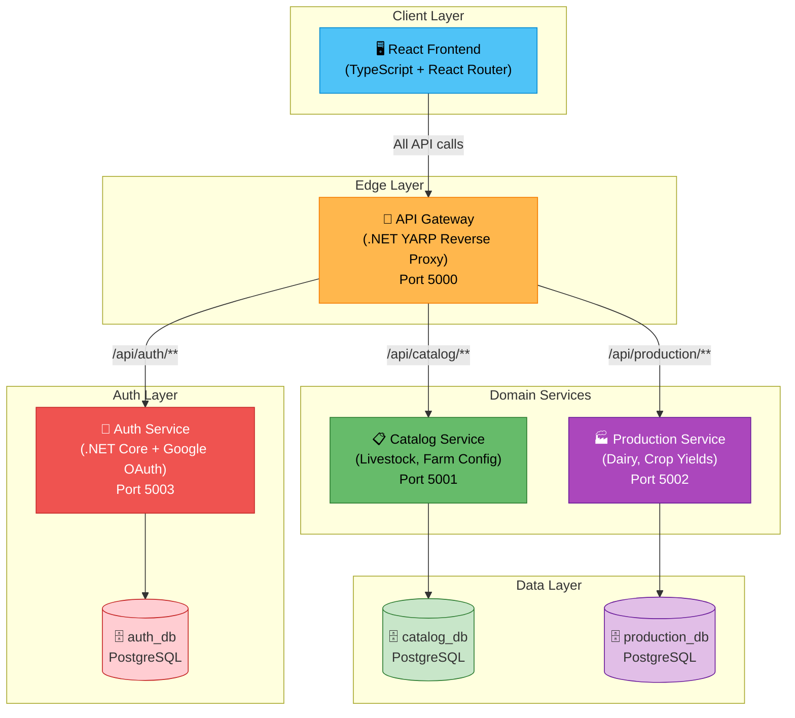
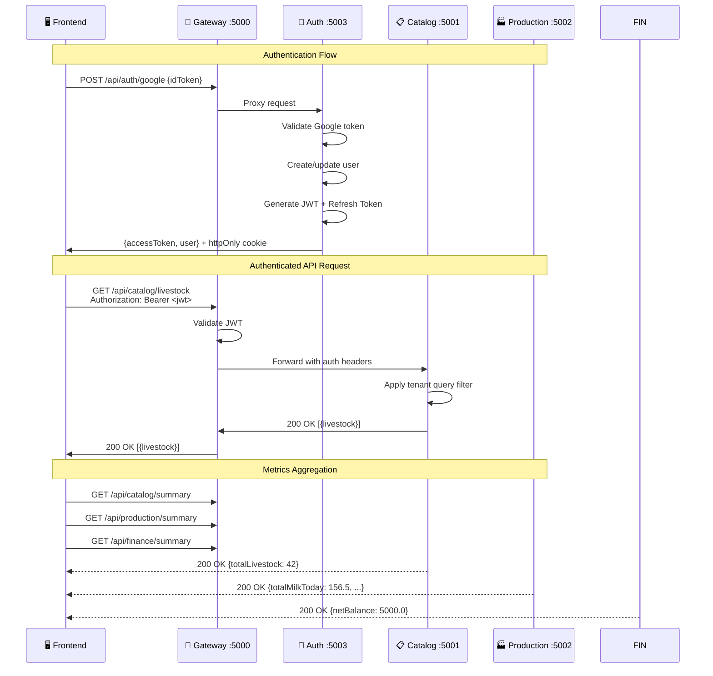

# 🌾 Farm Management SaaS

A **production-grade, multi-tenant SaaS platform** for farmers to manage livestock, dairy production, and farm operations. Built with a microservices architecture using independent .NET Core APIs with separate PostgreSQL databases for service-level data isolation.

---

## Architecture Overview



---

## Key Features

| Feature | Implementation |
|---------|---------------|
| **Microservices** | Independent Catalog and Production .NET Core APIs |
| **Data Isolation** | 3 separate PostgreSQL databases (auth, catalog, production) |
| **API Gateway** | YARP reverse proxy with metrics aggregation fan-out |
| **Authentication** | Google OAuth 2.0 + JWT with refresh token rotation |
| **Multi-Tenancy** | Tenant ID on every entity with global query filters |
| **Containerization** | Docker Compose with health checks, named volumes |
| **Rate Limiting** | Per-IP rate limiting at the gateway (100 req/min) |
| **Dynamic UI** | Centralized config-driven sidebar, routing, and feature flags |
| **i18n** | Multi-language support (English, Marathi) |
| **API Versioning** | URL-based versioning on all endpoints |

---

## Service Communication



---

## Tech Stack

| Layer | Technology |
|-------|-----------|
| **Frontend** | React 19, TypeScript, React Router, Recharts, i18next |
| **API Gateway** | .NET 10, YARP Reverse Proxy |
| **Auth Service** | .NET 10, Google OAuth 2.0, JWT (HMAC-SHA256) |
| **Catalog API** | .NET 10, Entity Framework Core, PostgreSQL |
| **Production API** | .NET 10, Entity Framework Core, PostgreSQL |
| **Shared Kernel** | .NET 10 Class Library (BaseEntity, Middleware, Auth Extensions) |
| **Database** | PostgreSQL 16 (3 isolated instances) |
| **Containerization** | Docker, Docker Compose |
| **Web Server** | Nginx (frontend serving + API proxy) |

---

## Project Structure

```
farm-management-saas/
├── docker-compose.yml              # Orchestrates all 8 services
├── .env.example                    # Environment variable template
│
├── services/
│   ├── api-gateway/                # YARP reverse proxy (port 5000)
│   ├── auth-service/               # Google OAuth + JWT (port 5003)
│   ├── catalog-api/                # Livestock domain (port 5001)
│   └── production-api/             # Dairy domain (port 5002)
│
├── shared/
│   └── FarmManagement.SharedKernel/ # Shared library (BaseEntity, Middleware)
│
├── frontend/                       # React + TypeScript
│   └── src/
│       ├── auth/                   # AuthContext, ProtectedRoute
│       ├── config/                 # Centralized app.config.ts
│       ├── components/layout/      # AppShell, Sidebar (config-driven)
│       ├── pages/                  # Dashboard, Livestock, Dairy
│       └── services/               # API client with JWT interceptor
│
└── backend/                        # [Legacy] Original monolith (preserved)
```

---

## Quick Start

### Prerequisites

- [Docker](https://www.docker.com/) & Docker Compose
- [Google Cloud Console](https://console.cloud.google.com/) OAuth 2.0 credentials

### 1. Clone & Configure

```bash
git clone https://github.com/Aditya-Y-Gitte/farm-management-saas.git
cd farm-management-saas

# Copy environment template and fill in your values
cp .env.example .env
# Edit .env with your Google OAuth credentials and a strong JWT secret
```

### 2. Run with Docker Compose

```bash
docker-compose up --build
```

This starts all services:
- **Frontend**: http://localhost:3000
- **API Gateway**: http://localhost:5000
- **Auth Service**: http://localhost:5003
- **Catalog API**: http://localhost:5001
- **Production API**: http://localhost:5002

### 3. Verify Health

```bash
curl http://localhost:5000/health
```

Expected response:
```json
{
  "status": "healthy",
  "services": {
    "catalog-api": "healthy",
    "production-api": "healthy"
  }
}
```

---

## Security

| Layer | Measure |
|-------|---------|
| **Edge** | CORS strict origin whitelist, Rate limiting (100 req/min/IP) |
| **Auth** | Google OAuth 2.0 — no password storage |
| **Tokens** | HMAC-SHA256 JWT, 15-min access tokens, 7-day refresh tokens |
| **Token Rotation** | Old refresh tokens revoked on use |
| **Transport** | HTTPS-ready, httpOnly secure cookies for refresh tokens |
| **Data** | Tenant isolation via EF Core global query filters |
| **Database** | 3 separate PostgreSQL databases |
| **API** | RFC 7807 ProblemDetails error responses, correlation IDs |
| **Containers** | Non-root users, multi-stage builds, health checks |

---

## Adding a New Module

The architecture is designed for easy extension. To add a new module (e.g., Crop Management):

1. **Backend**: Create a new service under `services/crop-api/` following the Catalog API pattern
2. **Gateway**: Add a new YARP route in `api-gateway/appsettings.json`
3. **Docker Compose**: Add the new service and its database
4. **Frontend**: Add one entry to `src/config/app.config.ts`:

```typescript
{
  id: 'crops',
  label: 'Crops',
  icon: '🌾',
  path: '/crops',
  apiBasePath: '/api/production/crops',
  enabled: true,
  description: 'Track planting, harvesting, and crop yields'
}
```

The sidebar, routing, and API client automatically pick up the new module.

---

## Modules Roadmap

- [x] **Livestock Management** — CRUD with health tracking, vaccinations
- [x] **Dairy Management** — Daily milk production, quality analytics
- [ ] **Crop Management** — Planting, harvesting, yield tracking
- [ ] **Financial Management** — Income, expenses, profitability
- [ ] **Inventory Management** — Feed, medicine, supplies
- [ ] **IoT Integration** — Sensor data for real-time monitoring
- [ ] **AI Services** — Predictive analytics, anomaly detection

---

## Deployment

The application is designed for cloud deployment using free/low-cost services:

- **Containers**: Any container platform (Railway, Render, AWS ECS, Azure Container Apps)
- **Database**: Managed PostgreSQL (Neon, Supabase, AWS RDS Free Tier)
- **Frontend**: CDN-backed hosting (Netlify, Vercel, Cloudflare Pages)

---

## License

MIT
