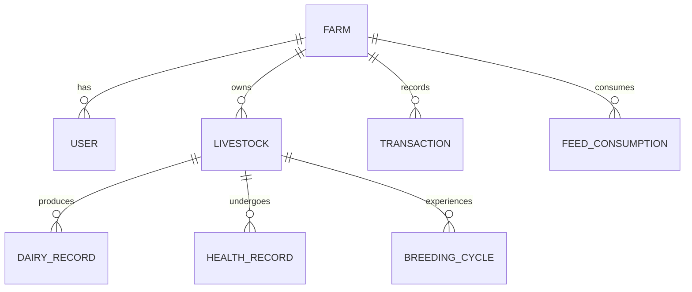

# Target Domain Model

This document establishes the target domain model for the Farm Management SaaS (FMS), addressing the gaps identified in the architecture audit. It serves as the data contract before backend implementation.

---

## 1. Ownership & Authorization Boundaries

To support multi-tenancy and secure isolation, all domain entities must be scoped to a specific farm. 

### Entity: `Farm` (Tenant)
- **Purpose**: Represents the top-level isolation boundary for a user's data.
- **Required fields**: `Id`, `Name`, `CreatedAt`
- **Optional fields**: `OwnerId`, `Location`
- **Relationships**: Parent to all operational records (Livestock, Dairy, Finance, etc.)
- **Indexes**: `Id` (PK)
- **Lifecycle**: Created during user registration.

### Entity: `User`
- **Purpose**: Represents the authenticated individual managing the farm.
- **Required fields**: `Id`, `FarmId`, `AuthId` (e.g., Google Subject ID), `Email`, `Role` (Owner, Worker)
- **Relationships**: Belongs to `Farm`.
- **Validation**: Email must be unique. `AuthId` must be unique.

*Important Authorization Rule: Every query for domain entities MUST filter by `FarmId` extracted from the authenticated user's token.*

---

## 2. Core Domains

### 2.1 Livestock Domain
#### Entity: `Livestock`
- **Purpose**: Represents an individual animal on the farm.
- **Required fields**: 
  - `Id` (Guid, PK)
  - `FarmId` (Guid, FK)
  - `TagNumber` (String) - Visible identifier used by the farmer
  - `Species` (Enum/String: Cow, Buffalo, Goat, etc.)
  - `Gender` (Enum/String: Male, Female)
  - `Status` (Enum/String: Active, Sold, Deceased)
- **Optional fields**: `Name`, `Breed`, `DateOfBirth`, `DamId` (Mother), `SireId` (Father), `Notes`
- **Relationships**: 
  - Belongs to `Farm`
  - 1-to-Many with `DairyRecord`, `HealthRecord`, `BreedingCycle`
  - Self-referencing (optional) to Dam/Sire.
- **Indexes**: `(FarmId, TagNumber)` (Unique per farm), `(FarmId, Status)`
- **Validation**: `TagNumber` must not be empty and must be unique within the farm. `DateOfBirth` cannot be in the future.
- **Lifecycle**: Created -> Active -> (Sold/Deceased).

### 2.2 Dairy Domain
#### Entity: `DairyRecord`
- **Purpose**: Tracks milk production per animal per session.
- **Required fields**:
  - `Id` (Guid, PK)
  - `FarmId` (Guid, FK)
  - `LivestockId` (Guid, FK)
  - `Date` (DateTime)
  - `Session` (Enum/String: Morning, Evening, Afternoon)
  - `YieldLiters` (Decimal)
- **Optional fields**: `FatContent` (Decimal), `ProteinContent` (Decimal), `QualityNotes` (String)
- **Relationships**: Belongs to `Livestock` and `Farm`.
- **Indexes**: `(LivestockId, Date, Session)` (Unique), `(FarmId, Date)`
- **Validation**: `YieldLiters` must be > 0.
- **Lifecycle**: Insert-only for daily tracking, updated only for corrections.

### 2.3 HealthRecord Domain
#### Entity: `HealthRecord`
- **Purpose**: Tracks vaccinations, medical treatments, and illness events.
- **Required fields**:
  - `Id` (Guid, PK)
  - `FarmId` (Guid, FK)
  - `LivestockId` (Guid, FK)
  - `RecordDate` (DateTime)
  - `Type` (Enum/String: Vaccination, Illness, RoutineCheck, Treatment)
  - `Description` (String)
- **Optional fields**: `TreatmentProvided`, `Cost` (Decimal), `AdministeredBy`, `NextDueDate`
- **Relationships**: Belongs to `Livestock`. May relate conceptually to an `Expense`.
- **Indexes**: `(FarmId, RecordDate)`, `(LivestockId)`
- **Validation**: `RecordDate` cannot be in the future.
- **Lifecycle**: Append-only log of medical history.

### 2.4 BreedingCycle Domain
#### Entity: `BreedingCycle`
- **Purpose**: Manages the reproduction cycle of female livestock.
- **Required fields**:
  - `Id` (Guid, PK)
  - `FarmId` (Guid, FK)
  - `LivestockId` (Guid, FK)
  - `StartDate` (DateTime)
  - `Status` (Enum/String: InHeat, Inseminated, Pregnant, Lactating, Dry, Calved, Failed)
- **Optional fields**: `InseminationDate`, `ExpectedDeliveryDate`, `ActualDeliveryDate`, `Notes`
- **Relationships**: Belongs to `Livestock`.
- **Indexes**: `(LivestockId, Status)`
- **Validation**: Restricted to Female livestock. `ExpectedDeliveryDate` must be > `InseminationDate`.
- **Lifecycle**: Operates as a State Machine. (e.g. InHeat -> Inseminated -> Pregnant -> Calved).

### 2.5 Finance Domain
#### Entity: `Transaction` (Covers Income and Expense)
- **Purpose**: Tracks farm revenue and operational costs.
- **Required fields**:
  - `Id` (Guid, PK)
  - `FarmId` (Guid, FK)
  - `Date` (DateTime)
  - `Type` (Enum/String: Income, Expense)
  - `Category` (String: MilkSale, Feed, Medicine, Salary, Equipment)
  - `Amount` (Decimal)
- **Optional fields**: `Quantity`, `UnitPrice`, `RelatedEntityId` (e.g., LivestockId), `Notes`
- **Relationships**: Belongs to `Farm`. Optional loose relation to `Livestock` (via `RelatedEntityId`).
- **Indexes**: `(FarmId, Date)`, `(FarmId, Type, Category)`
- **Validation**: `Amount` must be > 0.
- **Lifecycle**: Inserted on occurrence, rarely updated.

### 2.6 FeedConsumption Domain
#### Entity: `FeedConsumption`
- **Purpose**: Tracks inventory usage and daily feed distribution.
- **Required fields**:
  - `Id` (Guid, PK)
  - `FarmId` (Guid, FK)
  - `Date` (DateTime)
  - `FeedType` (String: Silage, Concentrates, Hay)
  - `QuantityKg` (Decimal)
- **Optional fields**: `LivestockId` (if tracking individual intake instead of herd), `Cost`
- **Relationships**: Belongs to `Farm`. Optionally belongs to `Livestock`.
- **Indexes**: `(FarmId, Date)`
- **Validation**: `QuantityKg` must be > 0.
- **Lifecycle**: Insert-only logs of daily consumption.

---

## 3. Entity Relationships Summary

## 4. Important Implementation Notes
1. **Decimal Precision**: All monetary and weight values (`Amount`, `YieldLiters`, `QuantityKg`) MUST use `decimal` in C# to prevent precision loss.
2. **Soft Deletes**: Consider soft-delete (`IsDeleted` boolean) for `Livestock` instead of hard deletion to preserve historical `DairyRecord` and `Transaction` integrity.
3. **Progressive Disclosure**: Only require minimum fields (e.g., TagNumber, Species) when creating an animal to keep the UI simple for the farmer, allowing optional fields (Breed, Sire, Dam) to be added later.
