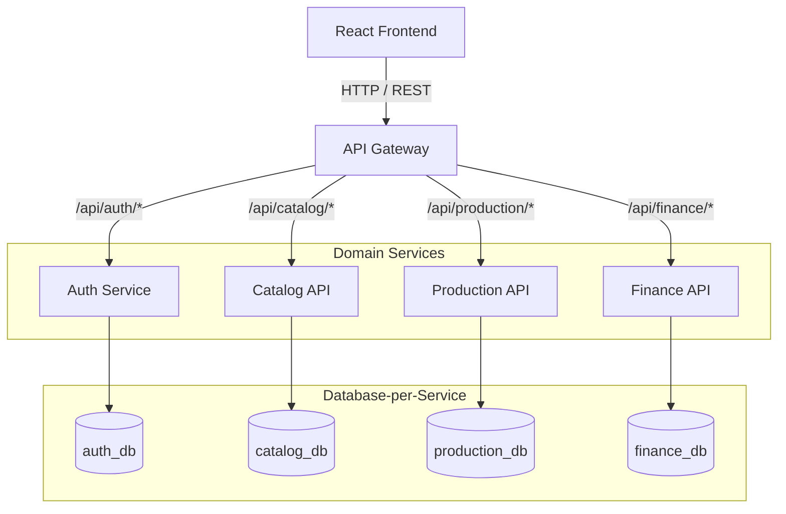

# Target Microservice Domain Model

This document outlines the correct, verified Domain Model for the active Farm Management SaaS runtime. It supersedes all previous legacy backend architecture diagrams.

## High-Level Architecture Map

The system utilizes a BFF (Backend-For-Frontend) API Gateway that securely proxies authenticated traffic to domain-specific microservices. Each microservice manages its own isolated logical database.

---

## 1. Catalog Domain
**Service:** `services/catalog-api`
**Database:** `catalog_db`
**Purpose:** Core registry of all farm physical assets and entities.

### Entities:
- **`Livestock`**: The central asset of a dairy/meat farm.
  - Required: `TenantId`, `TagNumber` (Unique per Tenant), `Species`, `Gender`, `Status`
  - Optional: `Breed`, `DateOfBirth`, `AcquisitionType`, `PurchasePrice`, `PurchaseDate`
- **`HealthRecord`**: Vaccinations, illnesses, and vet visits.
  - Required: `TenantId`, `LivestockId`, `Date`, `Type`, `Description`
- **`BreedingCycle`**: Insemination, pregnancy, and calving tracking.
  - Required: `TenantId`, `LivestockId`, `CycleStartDate`, `Status`

---

## 2. Production Domain
**Service:** `services/production-api`
**Database:** `production_db`
**Purpose:** Yield tracking and daily farm operations.

### Entities:
- **`Dairy`**: Milk yield records.
  - Required: `TenantId`, `LivestockId`, `Date`, `Session` (Unique constraint), `QuantityLiters`
  - *Note: `LivestockId` is a soft reference to a `Livestock` entity in `catalog_db`.*
- **`FeedConsumption`**: Tracking rations and feed usage.
  - Required: `TenantId`, `Date`, `FeedType`, `QuantityKg`

---

## 3. Finance Domain
**Service:** `services/finance-api`
**Database:** `finance_db`
**Purpose:** Ledger for farm profitability.

### Entities:
- **`Income`**: Revenue streams (milk sales, livestock sales, crop sales).
  - Required: `TenantId`, `Date`, `Amount`, `Category`
- **`Expense`**: Outflows (feed, medicine, salaries).
  - Required: `TenantId`, `Date`, `Amount`, `Category`

---

## 4. Auth & Identity Domain
**Service:** `services/auth-service`
**Database:** `auth_db`
**Purpose:** Tenant (Farm) provisioning, user registration, and JWT issuance.

### Entities:
- **`User`**: Account owner/manager.
  - Required: `TenantId`, `Email` (Unique), `PasswordHash` or `GoogleId`
  - Role: `Admin`, `Worker`
- **`RefreshToken`**: Session management.
  - Required: `UserId`, `TokenHash`, `ExpiryDate`

---

## Cross-Domain Consistency Rules

1. **Tenant Isolation**: EVERY entity across EVERY service must possess a `TenantId` property. This defines the authorization boundary (i.e., a Farm).
2. **Soft Foreign Keys**: Services must reference entities in other services using GUIDs (e.g., `Dairy.LivestockId` references `Livestock.Id`). There are no hard EF Core Navigation Properties (`.Include(x => x.Livestock)`) across microservice boundaries.
3. **Data Aggregation**: If the frontend requires a combined view (e.g., A Livestock profile with its Dairy history), the frontend makes two separate asynchronous calls (`livestockService.getLivestock(id)` and `dairyService.getDairies(livestockId)`), or the API Gateway is expanded to perform GraphQL-style federation. Microservices do not query other microservices synchronously.
